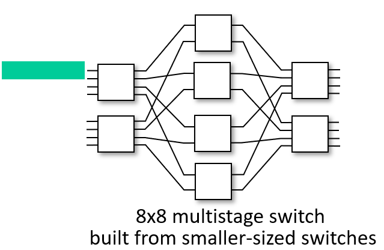

## *4-2 What's inside a router*

- *input ports, switching, output ports*
- *buffer management, scheduling*

# Router architecture overview

라우터는 크게 routing processor와 switching fabric으로 이루어져 있다. switching fabric의 input port와 output port 각각에는 line-card들이  꽂혀 있다. line-card는 일종의 input, output 인터페이스라고 생각하면 된다.

forwarding data plane: switching fabric은 input port의 line-card와 output port의 line-card를 연결해주는 forwarding 역할을 한다. 즉 line-card의 네트워크 역할을 한다. 이는 하드웨어가 처리하는 것이므로 매우 빠르게 동작한다. ns scale.

routing processor: 각각의 line-card들에게 라우팅 테이블 데이터를 전달한다. 테이블을 만드는 알고리즘을 돌리는 소프트웨어적 처리를 하다보니 비교적 시간이 오래 걸린다. ms scale.

# Input port functions

위 그림은 line-card를 나타낸 것이다. line-card는 크게 세 부분으로 나뉘어져 있고, 각각 1계층의 데이터, 2계층의 데이터, 3계층의 데이터를 받아들인다.

- physical layer: 비트 레벨의 데이터를 받아들인다. frame으로 쪼개어 2계층으로 전달한다.
- link layer: 보통 Ethernet을 사용하므로 Ethernet frame의 헤더를 확인 후 제거한다. 이렇게 만들어진 패킷을 3계층으로 전달한다.
- decentralized switching: 패킷의 헤더를 읽고, 라인 카드마다 들어있는 라우팅 테이블을 통해 매치되는 output port를 찾아 switch fabric으로 넘긴다. 빠져나가는 속도보다 들어오는 속도가 더 빠르면 input port queueing이 발생한다.
- forwarding 하는 방법은 두 가지가 있다.
  - **destination-based forwarding**: 목적지 IP만 확인하여 매치되는 output port를 결정한다.
  - **generalized forwarding** (SDN): 필드의 다양한 부분을 확인하여 forwarding한다.

# Destination-based forwarding: Longest prefix matching

forwarding table은 destination address range에 대한 link interface의 표이다. 목적지 주소 범위에 따라 적절한 output link를 지정해주는 것이다. 주소는 1, 0, *을 배치해 32 bit의 크기로 나타내어지는데(IPv4), *은 1이나 0 어떤 것이 와도 상관없다는 의미이다. 이 방식을 **ternary content addressable memories (TCAMs)** 라고 부른다.

패킷에 적혀진 목적지 IP와 매치시킬 때는 가장 길게 매칭되는 것의 output link로 결정한다. 이를 **longest prefix matching**이라고 한다. 이 방식을 사용하는 이유는, 앞으로 배울 IP addressing과 관련된다.

# Switching fabrics

switching fabric은 input link로 들어온 패킷을 적절한 output link로 내보낸다. 패킷이 input에서 output으로 나갈 수 있는 비율을 switching rate이라고 한다. 

switching fabric에는 크게 세 가지 타입이 있다.

- switching via memory: 컴퓨터가 라우터 역할을 한다. input port로 들어온 패킷을 카피해 시스템 메모리에 보낸 후, 다시 카피해서 적절한 output port로 보낸다. 카피하는데 시간이 오래 걸린다. 요즘에는 거의 안쓴다.

- switching via a bus: datagram이 shared bus를 통해 input port에서 output port로 이동한다. bus bandwidth에 재한이 있기 때문에 스피드가 떨어진다. 요즘에는 거의 안쓴다.

- switching via interconnection network: Crossbar, Clos networks 등 다양한 interconnection 네트워크를 만들어 forwarding한다. 보통 이것을 사용한다.

  

  - multistage switch: 스위칭 단계를 여러개로 나뉘어 각 단계의 크기에 맞는 작은 사이즈의 스위치를 배치한다.

  - exploiting parallelism: 최대한 신속하게 output으로 보내기 위해 패킷을 cell이라는 더 작은 단위로 쪼개, 각각의 cell을 다른 스위치로 보낸 후, 출구에서 다시 합쳐서 내보낸다.

    

  - backbone 급에 적용되는 라우터의 경우 interconnection network 자체를 여러개 놓아서 병렬로 처리한다. switching fabric 여러 개를 병렬로 사용한다고 생각하면 된다. 위 그림은 Cisco CRS router로 8개의 switching plane이 있고, 각각의 plane은 3-stage의 interconnection network로 구성된다. 이 라우터의 switching capacity는 100's Tbps까지 가능하다.

# Input port queueing

input port가 패킷을 받아들이는 속도보다 switch fabric이 패킷을 내보내는 속도가 느리면 input port 에 queueing이 발생한다. 

- **Head-of-the-Line (HOL) blocking:** 뒤쪽에서 대기중인 패킷이 앞 쪽에 있는 패킷이 대기중이어서 막혀있을 때, 이때 뒷쪽 패킷이 앞으로 오면 다른 루트로 바로 나갈 수 있을 경우 뒷쪽 패킷이 HOL blocking 되었다고 말한다.

# Output port queueing

인기있는 서버로 연결된 링크에 패킷이 몰리게 되면 output port에 queueing이 발생할 수 있다.

**buffer management:**

- drop: 버퍼가 다 찬 상태에서 패킷이 더해지면, 특정 패킷을 버려야 한다.
  - tail drop: 가장 나중에 버퍼로 들어온 패킷을 버린다. 보통 이 방법을 사용한다.
  - priority: 우선순위에 따라 버릴 패킷을 결정한다.
- marking: 패킷에 congestion signal을 마킹할 수 있다. (ECN: explicit condition notification, RED: random early detection)

# Packet Scheduling

packet scheduling: 큐에 들어있는 패킷들 중에서 어느 것을 링크로 내보낼지 결정하는 것.

- **FCFS:** first come, first served. FIFO와 같은 뜻
- **Priority scheduling:** 패킷에 우선순위를 매겨서 high priority queue와 low priority queue에 나눠서 보관하고 high priority queue에 들어있는 패킷을 우선적으로 내보낸다.
- **Round Robin (RR) scheduling:** 패킷에 class를 부여하고, 큐에 들어있는 패킷들을 각 클래스 별로 번갈아가면서 내보낸다.
- **Weighted Fair Queueing (WFQ):** RR과 priority를 합쳐놓은 것. 각 class에 가중치가 할당되어있다. 
