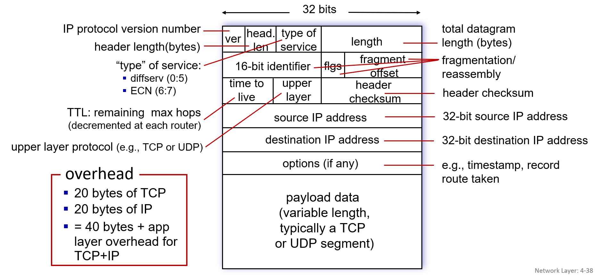

## *4-3  IP: the Internet Protocol*

- *datagram format*
- *addressing*
- *network address translation*
- *IPv6*

# IP Datagram format

header length: 헤더 크기는 기본 20B이고 option이 최대 40B까지 추가될 수 있다. 4B단위로 저장되어있음. 5 x 4B ~ 15 x 4B

length: 최근에는 Ethernet frame의 기본 size에 맞춰 1500B로 보내는 것이 일반적이다. 그래서 재조립에 필요한 fragmentation과 reassembly 부분이 필요 없어졌다.

TTL(time to live): 남아있는 hop count. 라우터 지날 때마다 1씩 줄어들음. 목적지 못찾고 헤매는 패킷을 버리기 위해 존재함.

uppaer layer: TCP인지 UDP인지.

# IP addressing: introduction

