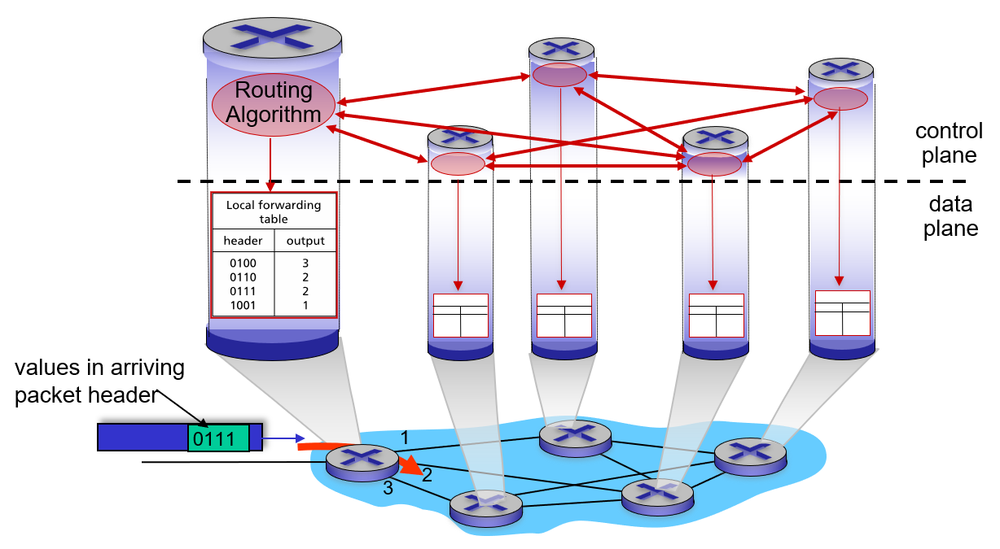
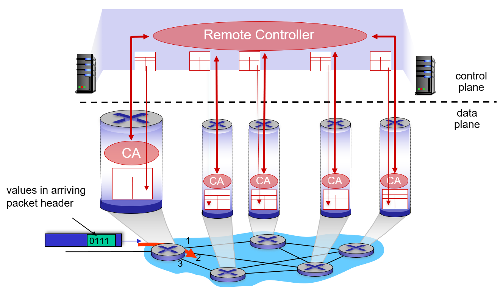

## *5-1 introduction*

# Network-layer functions

네트워크 layer의 기능은 크게 두 영역으로 나뉘어진다.

- **forwarding - data plane 영역**: 패킷을 라우터의 input으로 받아들여서 적절한 output으로 내보낸다.
- **routing - control plane 영역**: 각각의 패킷을 어떤 경로로 이동시킬지 결정한다.

네트워크 layer의 control plane을 구현하는 방법은 두 가지가 있다.

- per-router control (traditional): 라우터들끼리 정보를 교환해서 forwarding table을 만든다. 기존의 방식이며 아직까지도 많이 사용되고 있다.
- logically centralized control (software defined networking, SDN): controller 서버가 flow table을 만들어서 라우터들에게 보낸다.

# Per-router control plane

각각의 모든 라우터들이 라우팅 알고리즘을 돌려 서로 정보를 교환하고, 테이블도 라우터 내부에서 로컬하게 만들어 사용한다.

- forwarding table을 만드는 곳: in each and every router

라우터의 input port로 패킷이 들어오면, 라우터는 패킷의 헤더를 확인 후 자신이 만들어놓은 forwarding table과 매칭되는 output port를 찾아 패킷을 내보낸다. 이때 헤더에서 참조하는 정보는 목적지의 IP 주소이다.

# Software-Defined Networking (SDN) control plane

외부에 존재하는 컨트롤러가 라우터들로부터 받은 정보를 기반으로 테이블을 만들어 라우터들에게 배포한다.

- flow table을 만드는 곳: remote controller, 실제로는 여러 개의 분산된 서버들이 하나의 역할을 한다.

원격 컨트롤러가 라우터 각각의 flow table을 만들어 배포한다. forwarding이 아닌 flow라는 명칭을 사용하는 이유는, (4장에서 언급했듯이) 패킷의 정보에 따라 라우터가 forwarding이 아닌 다른 액션을 취할 수도 있기 때문이다. 이때 참고하는 패킷의 정보는 IP 주소 외에도 다양한 것들이 있을 수 있고, 상황에 따라 다른 영역의 정보를 참고한다. 이는 모두 remote controller가 만드는 flow table에 의해 결정된다.

