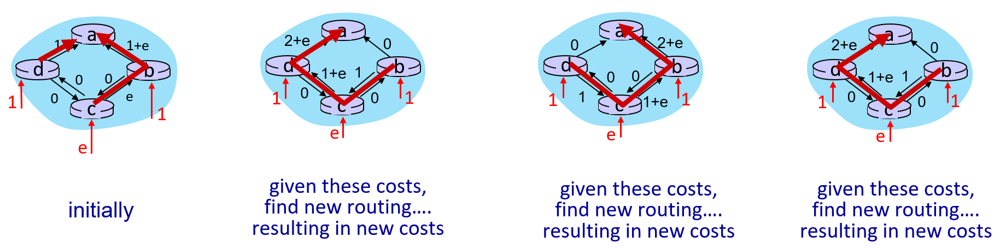

## *5-2 routing protocols*

- *link state*
- *distance vector*

# Routing protocol goal

라우팅 프로토콜은 패킷이 출발지 sending host부터 목적지 receiving host까지 가기 위한 "good" paths 를 결정한다.

- path: 패킷이 어떤 라우터들을 거쳐 가는지의 경로를 의미한다. sequence of routers.
- "good": 비용이 적게 드는, 빠른, 거리가 가까운, 혼잡도가 낮은 등등이 "good"이 될 수 있는 이유에 해당한다. 네트워크 관리자가 적절한 요소를 적절한 비중으로 지정하여 "good"의 정도를 판단한다.


# Graph abstraction: link costs

라우터가 링크들로 연결된 모습은 그래프로 나타낼 수 있다. 라우터는 node로, 라우터 사이의 링크는 edge로 표현한다. 이때 edge는 가중치가 있는 weighted edge이다. 가중치 cost는 대역폭 bandwidth, 혼잡도 congestion 등에 의해 달라지며, cost가 정해지는 기준은 네트워크 관리자가 결정한다.


graph: G = (N, E)

- N: set of routers = { u, v, w, x, y, z }
- E: set of links = { (u, v), (u, x), (v, x), (v, w), (x, w), (x, y), (w, y), (w, z), (y, z) }

c<sub>a, b</sub>: a와 b가 direct로 연결된 링크의 cost를 의미한다. direct로 연결되어 있지 않은 경우는 이 값이 무한대가 된다.

- e.g., c<sub>w, z</sub> = 5, c<sub>u, z</sub> = INF

위의 그림에서는 undirected edge로 표현되었지만, directed edge가 양방향으로 있는 것이 더 현실적이다. 라우터로 들어오는 input link와 나가는 output link의 상황이 다른것이 일반적인 경우이기 때문이다.


# Routing algorithm classification

global or decentralized information? : 한 라우터가 모든 링크의 cost 정보를 알고 돌리는 알고리즘인지, 자신과 직접 연결된 링크의 cost만 알고 돌리는 알고리즘인지에 따라 나눈다.

- **global:** 모든 라우터가 모든 링크의 cost 정보를 알고 있다.
  - **link state** algorithms: 이 알고리즘은 dijkstra shortest path를 이용한다. 다익스트라는 모든 edge의 cost 정보를 바탕으로 돌리는 알고리즘이다.

- **decentralized:** 각 라우터가 자신과 인접한 라우터까지의 링크들의 cost 정보만 알고 있고 나머지 링크들의 cost는 모른다. 때문에 자신과 이웃한 이웃들에게서 정보를 받아 알고리즘을 돌리는 것을 반복한다. 
  - **distance vector** algorithms: 이 알고리즘은 Bellman Ford를 이용한다. 벨만 포드는 이웃 노드들에게서 정보를 받고, 그것으로 자신의 정보를  업데이트하고, 그 정보를 이웃에게 보내고, 이웃이 그것과 이웃의 이웃이 준 정보로 업데이트 해서 자신에게 또 보내고, 그걸로 또 업데이트하고.. 이렇게 반복하는 알고리즘이다.

How fast do routes change? : 라우터가 자신의 정보를 얼마나 빠르게 업데이트하는 알고리즘인지에 따라 나눈다. 

- **dynamic**: 라우터가 자신의 정보를 빠르게 업데이트시킨다.  라우팅 알고리즘은 분산 알고리즘이기 때문에, 각 라우터 안에서 각자가 가진 정보를 바탕으로 알고리즘을 돌린다. 때문에 업데이트가 빠르면 라우터가 각자 다른 정보를 가지고 다른 계산을 할 가능성이 높아진다. 극단적인 경우 라우터가 서로에게 패킷을 핑퐁하는 상황이 발생할 수 있다. 빠르다고 무조건 좋은게 아니다.
- **static**: 반대로 라우터가 느리게 업데이트하는 경우이다.


***

## *link state*

# Dijkstra's link-state routing algorithm

- centralized: 해당 네트워크 영역 안에 있는 모든 라우터들은 모든 링크들의 cost 즉 link-state를 안다. 이 link-state 정보는 broadcast로  전송되어 모든 라우터에게 뿌려진다. 따라서 이론적으로 모든 라우터들은 같은 정보를 갖게 된다.
- link-state를 사용하는 영역의 라우터들은, 라우터 자신을 single source로 해서 모든 목적지로 가는 shortest path를 계산해 forwarding table을 작성한다. 

```
Initialization:
  N' = {u}  // N'은 shortest path tree에 포함된 노드들의 집합
  for all nodes v
    if v adjacent to u: // 시작점 u와 이웃한 노드 u 까지의 거리 D(v)는
      D(v) = c(u, v)  // u와 직접 연결된 링크의 cost로 초기화된다.
    else D(v) = INF  // 이웃노드가 아닐 경우 무한대로 초기화시킨다.
    
Loop:
  find w not in N' such that D(w) is a minimum // 현재까지 작성된 shortest-path tree에서 가장 가까운 노드 w를 찾아서
  add w to N'  // w를 shortest-path tree 안의 P(w)의 자식 노드로 추가시킨다.
  update D(v) for all v adjacent to w and not in N':  // N' 밖에 있에 있는 노드 중 w와 이웃한 노드 v가
    if D(w) + c(w, v) < D(v):  // 기존 경로보다 w를 지나서 가는 경우가 더 짧으면
      D(v) = D(w) + c(w, v)  // w를 지나는 경로의 길이로 업데이트시키고
      P(v) = w  // v로 도착하기 직전에 지나는 노드를 w로 업데이트시킨다.
until all nodes in N'  // 모든 노드가 N', shortest path tree에 포함될 때까지 반복한다.
```

loop가 한 번 반복될 때마다 N' 즉 shortest path tree에 노드가 하나씩 추가된다. D(v)가 업데이트 될 때마다 부모 노드 값인 P(v)도 업데이트 시켜주면 shortest path의 길이 뿐만 아니라 경로를 알 수 있게 된다.


위의 예시는 라우터 u가 자신을 single source로 하는 다익스트라 알고리즘을 돌린 것이다. 다익스트라 알고리즘을 돌리면 모든 노드에 대해 최단경로를 알려주는 shortest-path-tree가 작성되고, 이를 바탕으로 forwarding table을 작성할 수 있다. forwarding table에는 목적지에 따라 라우터 u에서 어떤 output link를 따라가면 되는지의 정보가 담겨 있다.


# Dijkstra's algorithm: discussion

**algorithm complexity: O(nlogn)**

- 이웃 노드 수가 최대 n - 1개 이므로 루프 한 번 도는데 O(logn). D값을 priority heap에 넣어서 돌리면 가능하다.
- 루프를 n번 돌기 때문에 결과적으로 O(nlogn)

**message complexity: O(n<sup>2</sup>)**

- 각 라우터는 link state 정보를 n개의 다른 라우터들에게 broadcast로 알려야 한다. broadcast algorithm은 최소 O(n)번의 link crossing으로 가능하다고 한다. 이것을 n개의 라우터가 하고 있으므로 O(n<sup>2</sup>)이 된다. 

# Dijkstra's algorithm: oscillation possible

모든 라우터가 동일한 topology link state 정보를 가지고 알고리즘을 돌리기 때문에 특정 링크에 traffic이 몰렸다가, 또 다른 쪽의 링크에 traffic이 몰리는 현상이 반복되기도 한다. 모두가 traffic이 몰린 부분을 피하려다가, 다른 부분에 traffic이 모이게 되서 발생한다. 이는 운전자들이 같은 네비게이션의 정보를 보고 특정 도로에 차가 몰리는 현상과 비슷하게 생각하면 된다. 이때 네비게이션은 모든 사용자에게 같은 최적 경로를 알려준다.




***

## *distance vector*

# Distance vector algorithm: Bellman-Ford

벨만 포드 알고리즘에 의해, 노드 x로부터 노드 y까지의 최소 거리를 나타내는 distance vector인 D<sub>x</sub>(y)는 x의 이웃 노드들인 v에 대해 다음과 같이 정의된다. 이때 y는 x와 같은 라우팅 알고리즘을 사용하는 네트워크 영역에 속한 모든 노드이다.

**D<sub>x</sub>(y) = min<sub>v</sub> { c<sub>x, v</sub> + D<sub>v</sub>(y) }** 

c<sub>x, v</sub>는 x가 갖고 있는 local link cost 정보이고, D<sub>v</sub>(y)는 x가 자신의 이웃 노드 v로부터 받은 DV 정보이다. 

- **iterative, asynchronous**: 각각의 라우터는 다음의 두 가지 정보가 바뀔 때에만 벨만 포드 알고리즘을 돌려 자신의 DV를 업데이트시킨다. 즉 각 노드가 비동기적으로 반복적인 작업을 수행한다.
  - 자신과 이웃 사이의 링크인 local link의 cost가 바뀔 때
  - 이웃으로부터 업데이트된 DV 정보를 받을 때

- **distributed, self-stoppnig**: 각각의 라우터는 자신의 DV 정보가 바뀌었을 때에만 이웃들에게 업데이트된 자신의 DV 정보를 전달한다. distributed. x가 자신의 이웃 y에게 업데이트된 DV 정보를 보냈을 때,
  - y는 자신의 DV를 업데이트 시키고, 변한 부분이 있으면 자신의 이웃 z에게 전달하고, 변한 부분이 없으면 z에게 전달하지 않는다. self-stopping.
  - 이웃들에게서 아무 정보를 받지 않은 노드 w는 액션을 취하지 않는다.


# Distance vector: state information diffusion

broadcast로 모든 링크 정보를 모든 노드에 뿌려대는 link state 알고리즘과 다르게, DV 알고리즘은 각 노드가 이웃 노드한테만 distance vector의 정보를 보낸다. 즉 이웃에게 전달하는 과정을 반복하면서 정보가 널리 퍼지게 된다. 이 반복 과정을 단계별로 생각해보면, 다음 그림과 같이 생각해 볼 수 있다.


t=0일 때의 c의 상태가 각 노드에게 도착하는 시점을 생각해보자. 이때 t는 노드들의 action을 동기화 시킬 때를 가정한 iterative term이고, c<sub>t=0</sub>은 t=0일 때의 c의 상태이다.

t=1일 때 c와 1 hop 만큼 떨어진 b까지 c<sub>t=0</sub>가 전달되고, t=2일 때 c와 2 hop만큼 떨어진 a와 e까지 c<sub>t=0</sub>가 전달되고, ... , t=4일 때 c와 4 hop만큼 떨어진 g와 i까지 c<sub>t=0</sub>가 전달된다.


# Distance vector: link cost change

앞에서 다뤘듯이 한 노드가 local link cost가 바뀐 것을 감지했을 때, DV를 재계산하고, DV가 업데이트 된 경우 이웃에게 알린다. 특이하게도, link cost가 줄었을 때와 늘었을 때의 노드들의 업데이트 속도가 현저하게 다르다.

- **"good news travels fast"**: link cost가 줄어든 경우 노드들의 DV 업데이트가 빠르게 끝난다.

  

  t<sub>0</sub>: y가 c<sub>y, x</sub> = 1로 변경된 것을 확인. y가 D<sub>y</sub>(x) = 4에서 D<sub>y</sub>(x) = c<sub>y, x</sub> + D<sub>x</sub>(x) = 1 + 0 = 1로 업데이트하고 이웃에 전달.

  t<sub>1</sub>: z가 y에게서 D<sub>y</sub>(x) = 1 받음. D<sub>z</sub>(x) = 5에서 D<sub>z</sub>(x) = c<sub>z, y</sub> + D<sub>y</sub>(x) = 1 + 1 = 2로 업데이트하고 이웃에 전달.

  t<sub>2</sub>: y가 z에게서 D<sub>z</sub>(x) = 2 받음. D<sub>y</sub>(x) = 1이므로 업데이트 안하고 이웃에게 전달 안함.

  -> 2 terms 안에 모두 업데이트 됨.

- **"bad news travels slow"**; count-to-infinity problem: link cost가 늘어난 경우 노드들의 DV 업데이트가 되는데 오래 걸린다.

  

  t<sub>0</sub>: y가 c<sub>y, x</sub> = 60으로 변경된 것을 확인. D<sub>y</sub>(x) = 4에서 D<sub>y</sub>(x) = c<sub>y, z</sub> + D<sub>z</sub>(x) = 1 + 5 = 6 으로 업데이트하고 이웃에 전달. 

  t<sub>1</sub>: z가 y에게서 D<sub>y</sub>(x) = 6 받음. D<sub>z</sub>(x) = 5에서 D<sub>z</sub>(x) = c<sub>z, y</sub> + D<sub>y</sub>(x) = 1 + 6 = 7 로 업데이트하고 이웃에 전달.

  t<sub>2</sub>: y가 z에게서 D<sub>z</sub>(x) = 7 받음. D<sub>y</sub>(x) = 6에서 D<sub>y</sub>(x) = c<sub>y, z</sub> + D<sub>z</sub>(x) = 1 + 7 = 8 으로 업데이트하고 이웃에 전달. 

  t<sub>3</sub>: z가 y에게서 D<sub>y</sub>(x) = 8 받음. D<sub>z</sub>(x) = 6에서 D<sub>z</sub>(x) = c<sub>z, y</sub> + D<sub>y</sub>(x) = 1 + 8 = 9 로 업데이트하고 이웃에 전달.

  t<sub>4</sub>: D<sub>y</sub>(x) = c<sub>y, z</sub> + D<sub>z</sub>(x) = 1 + 9 = 10

  t<sub>5</sub>: D<sub>z</sub>(x) = c<sub>z, y</sub> + D<sub>y</sub>(x) = 1 + 10 = 11

  t<sub>6</sub>: D<sub>y</sub>(x) = 1 + 11 = 12

  t<sub>7</sub>: D<sub>z</sub>(x) = 1 + 12 = 13

  ...

  t<sub>44</sub>: D<sub>y</sub>(x) = 1 + 49 = 50

  t<sub>45</sub>: D<sub>z</sub>(x) = c<sub>z, x</sub> + D<sub>x</sub>(x) = 50 + 0 = 50 ...드디어 실재하는 루트를 찾아냄.

  t<sub>46</sub>: D<sub>y</sub>(x) = c<sub>y, z</sub> + D<sub>z</sub>(x) = 1 + 50 = 51

  -> 46 terms만에 모두 업데이트됨. 

   

# Comparison: Robustness of LS and DV algorithms

robustness: 견고성 - 라우터가 제대로 작동하지 않거나 공격받았을 때 알고리즘이 얼마나 버틸까

LS: 라우터 하나가 잘못된 link cost 정보를 보낼 수 있다. 그래도 각 라우터가 모든 링크 정보를 토대로 각자 테이블을 작성하기 때문에 영향이 덜하다.

DV: 라우터가 잘못된 path cost 정보를 보낼 수 있다. (black-holding) 만약 자신을 통하는 모든 길을 아주 작은 값이라고 전달하면 각 라우터는 이웃 라우터의 정보를 무조건적으로 신뢰하기 때문에 그 정보가 전 네트워크에 퍼져가게 된다. 결과적으로 그 라우터에 엄청난 트래픽이 몰릴 것이다.
